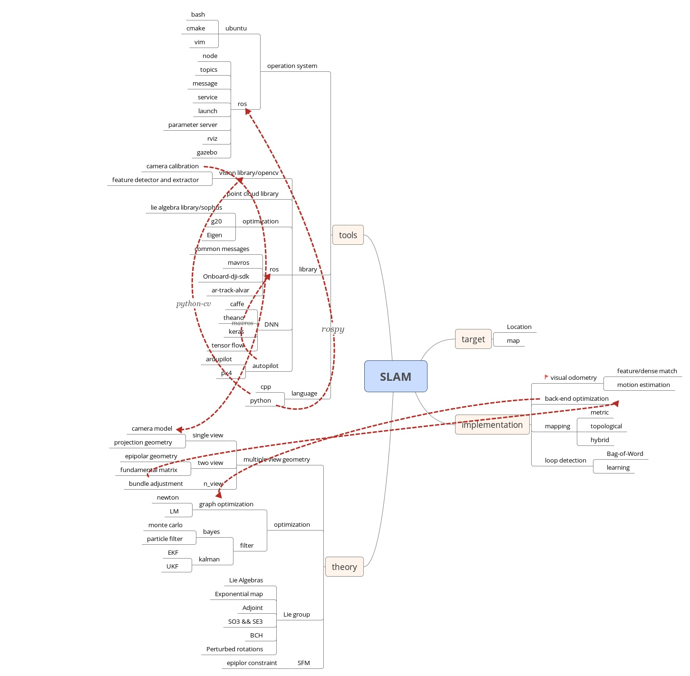

# VSLAM
----
## 综述
[关于slam](https://blog.csdn.net/yimingsilence/article/details/51701944)

[SLAM简介](https://zhuanlan.zhihu.com/p/21381490)

[SLAM的前世今生 终于有人说清楚了](https://www.leiphone.com/news/201605/5etiwlnkWnx7x0zb.html)

[SLAM第一篇：基础知识](https://www.leiphone.com/news/201609/iAe3f8qmRHXavgSl.html?viewType=weixin)

[移动机器人视觉里程计综述](http://html.rhhz.net/ZDHXBZWB/html/2018-3-385.htm#outline_anchor_20)

[波士顿等移动机器人的视觉算法解析](https://www.roboticschina.com/news/2346.html)

[那些珍贵的「视觉SLAM」课程资料总结（补充版/完整版）](https://mp.weixin.qq.com/s/kAdGdWDlw15ZmLzG56DOOA)

## 比较好的学习平台

[B站泡泡机器人](http://space.bilibili.com/38737757/#!/)

[SLAMCN](http://www.slamcn.org/index.php/%E9%A6%96%E9%A1%B5)

[易科机器人实验室](http://blog.exbot.net/)

[Awesome SLAM](https://github.com/kanster/awesome-slam#courses-lectures-and-workshops)

----
## 基础知识

三维空间的刚体运动

李群与李代数

相机参数标定

高斯牛顿，LM非线性优化方法

pnp

特征点描述子,特征点提取,特征点匹配

对极约束、本质矩阵、单应矩阵、三角化

随机抽样一致性算法

光流跟踪

SFM

IMU预积分和观测模型

QR分解SVD分解等矩阵分解方式求解满秩和亏秩最小二乘问题

Marginalization

BA优化

半闲居士系列：

* [视觉SLAM中的数学基础 第一篇](http://www.cnblogs.com/gaoxiang12/p/5113334.html)--3D空间的位置表示
* [视觉SLAM中的数学基础 第二篇](http://www.cnblogs.com/gaoxiang12/p/5120175.html)--四元数
* [视觉SLAM中的数学基础 第三篇](http://www.cnblogs.com/gaoxiang12/p/5137454.html)--李群与李代数

PCL点云:
* [如何查找和利用PCL库学习资源的一些心得](https://blog.csdn.net/shine_cherise/article/details/79285162)
* [具体案例源码参考](https://github.com/Ewenwan/MVision/tree/master/PCL_APP/Basic)
* 

图优化：
* [graph slam tutorial : 从推导到应用1](https://blog.csdn.net/heyijia0327/article/details/47686523)
* [graph slam tutorial ：从推导到应用２](https://blog.csdn.net/heyijia0327/article/details/47731631)

[找工作面试准备](aboutInteview.md)

 

----
## 提升

[一个简单的视觉里程计实现]()
 
[一起做RGB-D SLAM](http://www.cnblogs.com/gaoxiang12/p/4462518.html)
## 优秀文章

[SLAM代码（设计模式）](https://blog.csdn.net/wendox/article/details/53454768)和[SLAM代码（设计模式2）](https://blog.csdn.net/wendox/article/details/53489982)

## 大牛实验室和组织的网站
[机器人领域牛人列表](http://www.slamcn.org/index.php/%E6%9C%BA%E5%99%A8%E4%BA%BA%E9%A2%86%E5%9F%9F%E7%89%9B%E4%BA%BA%E5%88%97%E8%A1%A8)

卡耐基梅隆大学The Robotics Institute, Carnegie Mellon University [1](https://www.ri.cmu.edu/)

苏黎世联邦理工学院 Autonomous Systems Lab (ASL), ETH Zurich [2](http://www.asl.ethz.ch/)

明尼苏达大学 Multiple Autonomous Robotic Systems (MARS) Laboratory, University of Minnesota [3](http://mars.cs.umn.edu/index.php)

UW Robotics and State Estimation Lab [4](http://rse-lab.cs.washington.edu/)

慕尼黑工业大学 The Computer Vision Group, Technical University of Munich [5](https://vision.in.tum.de/)

宾夕法尼亚大学 Vijay Kumar Lab (GRASP Lab), University of Pennsylvania [6](https://www.kumarrobotics.org/)

苏黎世大学 Robotics and Perception Group (RPG), University of Zurich [7](http://rpg.ifi.uzh.ch/)

悉尼大学 australian centre for field robotics [8](https://sydney.edu.au/engineering/our-research/robotics-and-intelligent-systems/australian-centre-for-field-robotics.html)

澳大利亚机器人人视觉研究中心 [9](https://www.roboticvision.org/)

----
## SLAM方案

视觉稀疏法：ORB-SLAM 、PTAM、MonoSLAM

半稠密法：LSD-SLAM、DSO、SVO

稠密法：DTAM、Elastic Fusion、Kintinous、DVO、RGBD-SLAM-V2、RTAB-MAP、MLM等

激光：Hector SLAM、Gmapping、tinySLAM

后端优化：g2o、ceres、GTSAM

数据：RGB-D SLAM Dataset and Benchmark、KITTI Vision Benchmark Suite、The EuRoC MAV Dataset等。

## My Vision SLAM study and research

|适用类型|方案|代码注释|  
|--|--|--|
| 单目 | [DSO](https://github.com/MRwangmaomao/VSLAM/tree/master/DSO) || 
| 单目、双目、RGBD | [ORB-SLAM2](https://github.com/MRwangmaomao/VSLAM/tree/master/ORBSLAM2) | 注释链接(file:///D:/github/VSLAM/ORBSLAM2/ORB-SLAM2-master/doc/html/index.html)|
| 单目+IMU | [VINS](https://github.com/MRwangmaomao/VSLAM/tree/master/VINS) | |
| 单目，双目+IMU | [VINS-Fusion](https://github.com/MRwangmaomao/VSLAM/tree/master/VINS-Fusion) | |
----
 
## SLAM-Book 14 lesson

----
## 提问
#### 1.为什么要使用sliding window  
在基于graph based slam中，无论是pose graph还是bundle adjustment都是通过最小化损失来达到优化位姿和地图的目的。然而当待优化的位姿或者特征点坐标增多时，优化过程中的计算量也随着增大，因此不能无限的添加优化变量，使用滑动窗口技术来限制计算量在一定范围。
使用滑动窗口时还会涉及到“First Estimate Jacobians”，“Marginalization”，“Schur complement”等技术。

#### 2. marginalization技术

#### 3. ORBSLAM中的局部地图优化与DSO、OKVIS中的滑动窗口方法优化的区别  
ORB-SLAM中的Local Mapping环节在做BA的时候刻意选择那些具有共同观测的帧作为关键帧，在这种情况下Schur消元后后得到的S矩阵(舒尔补消元后的矩阵)是稠密矩阵，由于局部地图优化不是实时的，所以这种做法可以接受。  
DSO中采用了滑动窗口方法对每一帧要求做一次BA来防止累计误差，因此采取了一些技巧来保持S矩阵的稀疏性。